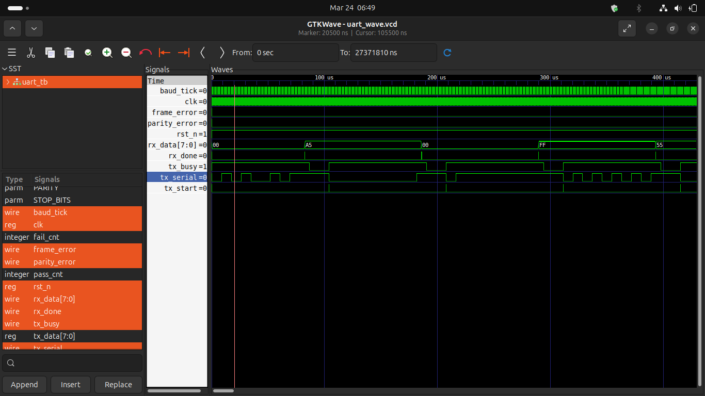
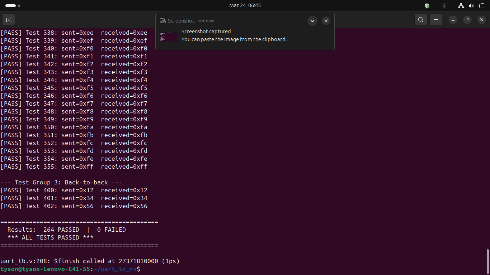

# UART Transmitter and Receiver


A fully verified, full-duplex UART Transmitter and Receiver implemented in Verilog using FSM-based sequential logic. Simulated with Icarus Verilog and verified with a self-checking testbench across **264 test cases — 0 failures**.

---

## Simulation Results



> `rx_data` correctly receives `00 → A5 → 00 → FF → 55`. `frame_error` and `parity_error` remain LOW throughout all 264 tests.



---

## Key Highlights

- Full-duplex UART transceiver with separate TX and RX FSMs
- 16x oversampling with majority-vote sampling for noise immunity
- Parameterizable baud rate, data width, parity, and stop bits
- Self-checking testbench — full 0x00–0xFF sweep (256 bytes) + edge cases
- Zero framing errors and zero parity errors across all test cases
- VCD waveform dump verified in GTKWave

---

## Skills Demonstrated

- RTL design using Verilog
- FSM-based sequential logic design
- Clock domain and baud rate generation
- Serial protocol framing (start, data, parity, stop bits)
- Functional verification with self-checking testbenches
- Waveform analysis using GTKWave

---

## Technical Theory — How UART Works

**UART (Universal Asynchronous Receiver/Transmitter)** is a serial communication protocol that transmits data one bit at a time over a single wire per direction. Unlike SPI or I2C, UART is asynchronous — there is no shared clock line. Both devices must be pre-configured to the same baud rate before communication begins.

### Signal Levels and Idle State

The TX line is held **HIGH (logic 1)** when idle. A transmission begins with a **start bit** that pulls the line LOW (logic 0), signalling the receiver that a frame is incoming. After all data bits are sent, a **stop bit** returns the line HIGH, marking the end of the frame.

### Frame Structure

| Bit | Value | Purpose |
|-----|-------|---------|
| Start bit | 0 | Signals start of frame |
| Data bits (D0–D7) | variable | Payload, sent LSB-first |
| Parity bit (optional) | 0 or 1 | Error detection |
| Stop bit(s) | 1 | Marks end of frame, resets line |

This project uses the standard **8N1** configuration: 8 data bits, no parity, 1 stop bit.

### Baud Rate and Bit Timing

At **115200 baud**, each bit lasts approximately **8.68 µs**. Since there is no clock wire, the receiver must derive bit boundaries from the start bit's falling edge.

### 16x Oversampling

Each bit period is divided into 16 sub-ticks:

- The **start bit** is confirmed at tick 8 (midpoint) to reject glitches shorter than half a bit period
- Each **data bit** is sampled at ticks 7, 8, and 9 and **majority-voted** — 2-of-3 agreement determines the bit value
- The **stop bit** is validated at its midpoint; if it reads LOW, a framing error is flagged

### Wiring

```
Device A                Device B
   TX  ────────────────►  RX
   RX  ◄────────────────  TX
   GND ─────────────────  GND
```

---

## Block Diagram

```
             ┌─────────────┐     tx_serial      ┌─────────────┐
tx_data ────►│             ├───────────────────►│             ├──► rx_data
tx_start ───►│   uart_tx   │                    │   uart_rx   │──► rx_done
             │    (FSM)    │                    │    (FSM)    │──► frame_error
             └──────┬──────┘                    └──────┬──────┘──► parity_error
                    │                                  │
             ┌──────┴──────────────────────────────────┴──────┐
             │              baud_gen                           │
             │         (16x oversampling tick)                 │
             └─────────────────────────────────────────────────┘
                                    ▲
                               50 MHz clk
```

---

## FSM States

### TX FSM
```
IDLE ──(tx_start)──► START ──► DATA ──► PARITY ──► STOP ──► IDLE
                                        (if enabled)
```

### RX FSM
```
IDLE ──(rx LOW)──► START ──► DATA ──► PARITY ──► STOP ──► IDLE
                  (glitch    (majority  (if enabled) (assert
                  reject)     vote)                  rx_done)
```

---

## Module Overview

### `baud_gen.v` — Baud Rate Generator
Divides the 50 MHz system clock to produce a 16x oversampling tick.

```
DIVISOR = CLK_FREQ / (BAUD_RATE x 16)
        = 50,000,000 / (115200 x 16)
        = 27 clocks per tick
```

### `uart_tx.v` — Transmitter FSM

| State | Action |
|-------|--------|
| IDLE | Line held HIGH, waits for `tx_start` |
| START | Drives line LOW for one bit period |
| DATA | Shifts out 8 data bits LSB-first |
| PARITY | Sends parity bit (if enabled) |
| STOP | Drives line HIGH for stop bit(s) |

### `uart_rx.v` — Receiver FSM (16x Oversampling)

| State | Action |
|-------|--------|
| IDLE | Waits for falling edge on `rx` line |
| START | Confirms start bit at tick 8 (glitch rejection) |
| DATA | Majority-votes bits at ticks 7, 8, 9 |
| PARITY | Checks received parity vs computed |
| STOP | Validates stop bit, asserts `rx_done` |

### `uart_tb.v` — Self-Checking Testbench

| Test Group | Description | Count |
|------------|-------------|-------|
| Group 1 | Key bytes: 0xA5, 0x00, 0xFF, 0x55, 0xAA | 5 |
| Group 2 | Full sweep 0x00–0xFF | 256 |
| Group 3 | Back-to-back frames | 3 |
| **Total** | | **264** |

---

## Parameters

| Parameter | Default | Options |
|-----------|---------|---------|
| `CLK_FREQ` | 50_000_000 | Any system clock in Hz |
| `BAUD_RATE` | 115_200 | 9600, 19200, 38400, 57600, 115200 |
| `DATA_BITS` | 8 | 7, 8 |
| `PARITY` | 0 (none) | 0=none, 1=odd, 2=even |
| `STOP_BITS` | 1 | 1, 2 |

---

## Project Structure

```
uart_tx_rx/
├── baud_gen.v                  # Baud rate generator (16x oversampling tick)
├── uart_tx.v                   # UART Transmitter FSM
├── uart_rx.v                   # UART Receiver FSM with oversampling
├── uart_tb.v                   # Self-checking testbench
├── uart_output.txt             # Full simulation log (264 tests)
├── .gitignore
├── README.md
└── images/
    ├── gtk_wave_output.png
    ├── terminal_output.png
    └── terminal_output/
        ├── terminal_01_start.png
        ├── terminal_02_sweep_part1.png
        ├── terminal_03_sweep_part2.png
        ├── terminal_04_sweep_part3.png
        ├── terminal_05_sweep_part4.png
        ├── terminal_06_sweep_part5.png
        ├── terminal_07_sweep_part6.png
        ├── terminal_08_sweep_part7.png
        ├── terminal_09_sweep_part8.png
        └── terminal_10_final_pass.png
```

---

## How to Run

### Install tools
```bash
sudo apt install iverilog gtkwave
```

### Compile and simulate
```bash
iverilog -o uart_sim baud_gen.v uart_tx.v uart_rx.v uart_tb.v
vvp uart_sim
```

### View waveform
```bash
gtkwave uart_wave.vcd
```

### Expected output
```
============================================
  UART Loopback Testbench  (115200 baud)
============================================
--- Test Group 1: Key bytes ---
[PASS] Test 1: sent=0xa5  received=0xa5
[PASS] Test 2: sent=0x00  received=0x00
[PASS] Test 3: sent=0xff  received=0xff
...
--- Test Group 2: Full 0x00-0xFF sweep ---
[PASS] Test 100 through 355: All 256 values verified
--- Test Group 3: Back-to-back ---
[PASS] Test 400: sent=0x12  received=0x12
============================================
  Results:  264 PASSED  |  0 FAILED
  *** ALL TESTS PASSED ***
============================================
```

---

## Tools Used

| Tool | Purpose |
|------|---------|
| Icarus Verilog | Compilation and simulation |
| VVP | Verilog simulation runtime |
| GTKWave | Waveform visualization |
| VSCode | Code editing and GitHub upload |
|Vivado |(Xilinx)RTL simulation and waveform analysis|
---


